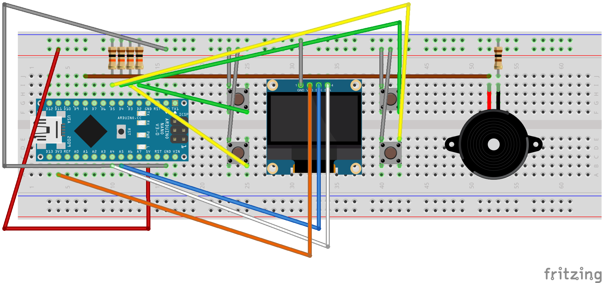

# 2Player Pong
Beginner arduino project.

Requirements
-------------
 - Arduino
 - SSD1306 I2C oled
 - 1x 100 Ohm resistor
 - 4x 10K Ohm resistor
 - 4x Pushbutton
 - 1x PC Speaker (optional)

Breadboard
----------

